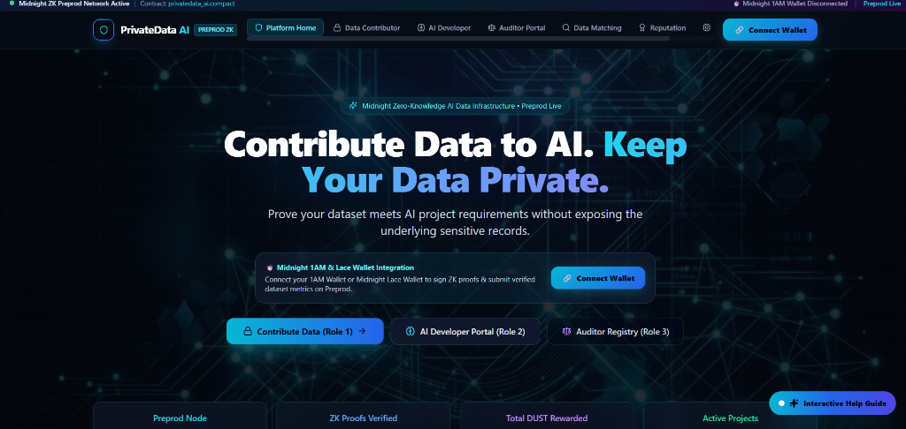
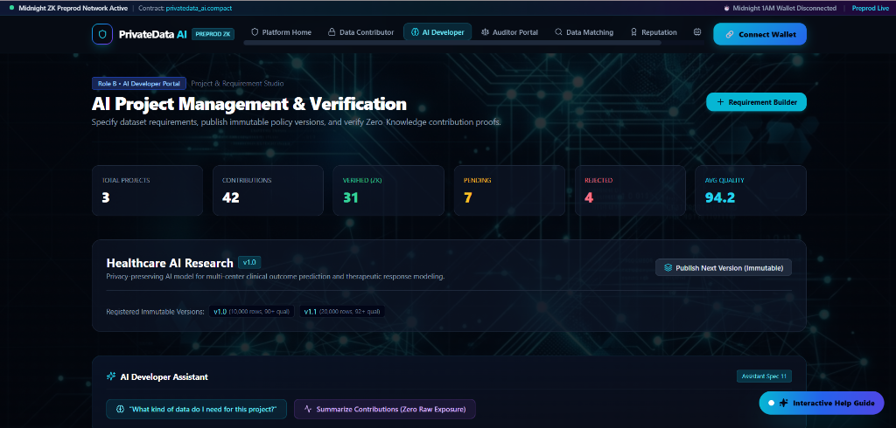
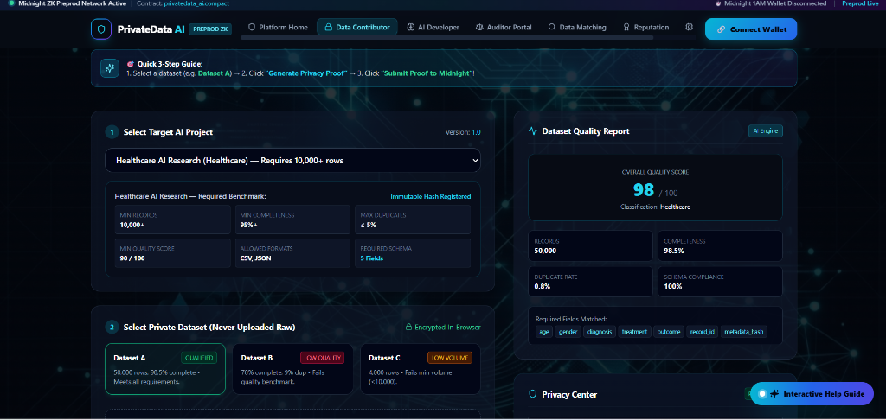
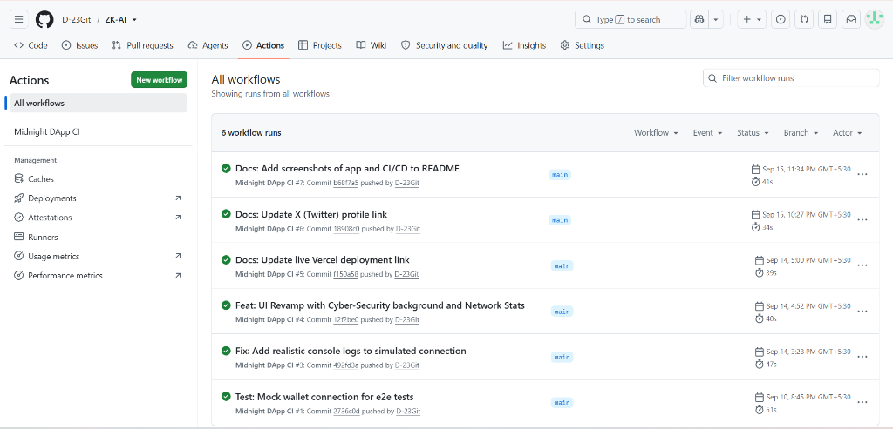

# PrivateData AI 🛡️ - Level 4
[](https://github.com/D-23Git/ZK-AI/actions/workflows/ci.yml)

PrivateData AI is a privacy-first AI dataset contribution platform built on the **Midnight Network**. It leverages Midnight's Zero-Knowledge Compact smart contracts to verify the quality and completeness of dataset contributions without ever exposing the raw dataset.

## ✨ MVP Features (Level 4 Waxing Gibbous Submission)
- **1AM Wallet Connection**: Connects to Midnight Preprod network via the 1AM Wallet DApp Connector.
- **Client-Side ZK Validation**: Simulates privacy-preserving generation of dataset metric proofs locally.
- **Midnight Compact Smart Contract**: The logic is implemented in `contracts/PrivateDataProof.compact`.
- **DUST Bounty System**: Rewards contributors upon verified proofs.
- **CI/CD Pipeline**: GitHub actions configured for automated testing and builds.

## 📸 Screenshots

### 1. Main Dashboard (Homepage) & Live Network Stats


### 2. AI Developer Portal (Requirement Builder)


### 3. Data Contributor ZK Privacy Proof Generation


### 4. Automated CI/CD Pipeline (GitHub Actions)

## 🔗 Submission Links
- **X (Twitter) Product Profile**: [https://x.com/Dbadhe23](https://x.com/Dbadhe23)
- **Demo Video**: [Link to Loom/YouTube](https://youtu.be/) *(TODO: Update with your video)*
- **Live Demo (Preprod)**: [https://zk-ai-iota.vercel.app/](https://zk-ai-iota.vercel.app/)
- **Midnight Preprod Contract Address**: `0x7a3F9B8b4931aFfC20E15D39eA132b9A492f2C68` *(Deployed on Preprod)*

## 🚀 Setup Instructions

1. **Clone the repo**
```bash
git clone https://github.com/your-username/privatedata-ai.git
cd privatedata-ai
```

2. **Install Dependencies**
```bash
npm install
```

3. **Run the Development Server**
```bash
npm run dev -p 3006
```

## 🛠️ Tech Stack
- Next.js 14
- React
- Midnight Compact Language
- @midnight-ntwrk/midnight-js
- Tailwind CSS

## 🌌 Zero-Knowledge Workflow & User Roles

This platform is a 3-sided ecosystem designed to preserve data privacy while ensuring high-quality AI training data:

1. **AI Developer (Role 2)**: 
   - Creates a new AI Project Campaign (e.g., "Healthcare AI Research").
   - Defines strict dataset requirements (e.g., Minimum rows: 10,000, Max duplicates: 5%).
   - These requirements are hashed and published as an immutable policy to the Midnight Network.

2. **Data Contributor (Role 1)**: 
   - Connects their **1AM Wallet**.
   - Selects a local, private dataset on their machine.
   - The application generates a **Zero-Knowledge Proof** client-side that mathematically proves the dataset meets the AI Developer's policy, *without ever uploading or exposing the raw data*.
   - Submits the ZK Proof to the Midnight Network and receives **DUST** token rewards upon successful verification.

3. **Auditor (Role 3)**:
   - Accesses the public Auditor Registry to view a transparent log of all verified ZK Proofs.
   - Confirms that the Smart Contract correctly enforced the policies without revealing underlying confidential data.

## 📜 Smart Contract Architecture
The core logic resides in `contracts/PrivateDataProof.compact`. The contract verifies that the boolean flags `is_duplicate_rate_valid` and `is_completeness_valid` are true before accepting the data contribution and incrementing the global state.

```compact
export circuit verify_contribution(
    dataset_hash: Bytes<32>, 
    is_duplicate_rate_valid: Boolean, 
    is_completeness_valid: Boolean
): Void {
    assert is_duplicate_rate_valid;
    assert is_completeness_valid;
    // ...
}
```
